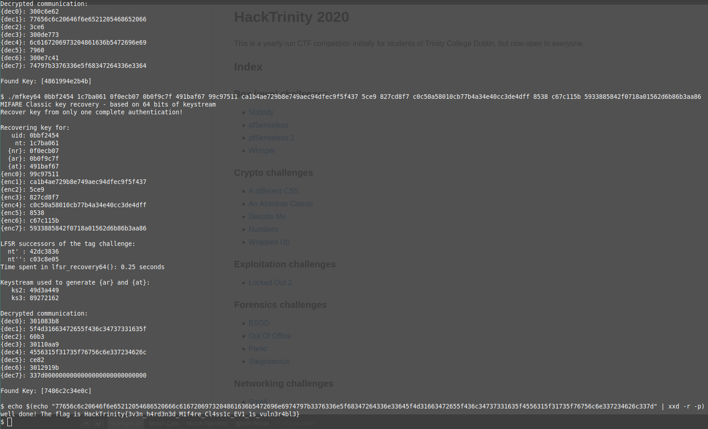

# An Absolute Classic - Crypto - 568 points - 8 solves
> I've written a flag to my TCD student card. This high tech RFID/NFC card supposedly has the best mutual encryption between the reader and card, so no one can find out the contents by sniffing the traffic.
> 
> Can you extract the flag from the traces?
### Files
- [traces.txt](traces.txt)

So I didn't know what kind of card TCD used but I had my own student card which I could check and found it used MIFARE Classic. Given the word Classic was in the title, I assumed I must be on the right track.

If anyone who participated in HackTrinity 2020 tried searching for CTF writeups of similar challenges you might have been disapointed to find there was almost nothing like this in any other CTF. Thats because this challenge was written Rory, one of HackTrinity's founder, who researched these cards as his final year project.
Having this inside knowledge I thought I could gain an advantage by reading his paper and watching [his talk at BSides Belfast](https://youtu.be/ZSrOq40z1i8). This unfortunatley did not help as he was talking about the more secure MIFARE Desfire EV1.

So off I go to read endless papers about how the MIFARE classic is a horribly insecure card and how easy it is to break the encryption with a modded reader or a fake card. However we don't have access to this card, simply the traffic sent. Either way the papers show how to interpret the data, specifically [Dismantling Mifare Classic](https://www.cs.bham.ac.uk/~garciaf/publications/Dismantling.Mifare.pdf).

Here is the traffic of first trace with annotations to describe what is being sent. Note that the first few lines is an anti-collision handshake that avoids the case where multiple cards could try responding to the reader.
```sh
| Rdr | 26                                                 # Req Type A
| Tag | 02 00                                              # Request Ack
| Rdr | 93 20                                              # SELECT
| Tag | 0b bf 24 54 c4                                     # Tag sends its uid,bcc
| Rdr | 93 70 0b bf 24 54 c4 f0 19                         # Reader selects uid, all other tags should stop responding
| Tag | 18 37 cd                                           # SAK
| Rdr | 50 00 57 cd                                        # Halt
| Rdr | 26                                                 # Checks for any other tags
| Rdr | 26
| Rdr | 26
| Rdr | 52                                                 # Restarts connection with card
| Tag | 02 00
| Rdr | 93 70 0b bf 24 54 c4 f0 19
| Tag | 18 37 cd
| Rdr | 60 0c 99 b1                                        # Authenticate for block 0x0C (12)
| Tag | d4 48 23 69                                        # Tag sends its nonce value: nT
| Rdr | 98 a7 8e b5 be dc d9 a2                            # Reader initializes encryption cipher and sends nR ^ ks1, aR ^ ks2
                                                           # nR is the readers nonce, aR is the answer to nT
                                                           # ks1 and ks2 are the first 2 words from the cipher keystream
| Tag | bd 8a 06 8d                                        # Tag sends its answer aT ^ ks3
                                                           # Handshake is complete, reader is now able to make encrypted read/write commands

| Rdr | e1 d3 71 61                                        # Read commands that are now encrypted
| Tag | 62 68 23 18 5a eb 43 1e 02 4c ca 52 7e 49 b6 27
|     | b5 be
| Rdr | 5d 0c 82 1f
| Tag | 44 b3 a7 59 61 65 91 42 79 cf b7 73 fc 99 85 70
|     | 0d 1f
| Rdr | 33 8a 1a 39
| Tag | a0 fb 92 59 94 d6 40 fa 4c 42 d3 a8 20 9d cd bd
|     | 8d 28
| Rdr | bd e5 b7 92
```

All the code I found online to crack the key required you have the parity bits which were mysteriously omitted so I thought that musn't be the strategy. Now initially I saw that there were default keys associated with MIFARE Classic so I thought it must be using one of those. So I spent ages writing some code to try a list of 700 common keys. But none of them worked, and it really hurt me.

Turned out I was on the right track initially, after some more depressed googling I found this script [mfkey64.c](https://github.com/Proxmark/proxmark3/blob/master/tools/mfkey/mfkey64.c) that I didn't manage to find from the first round of searching. This program required some knowledge of the structure of the traffic, so my research wasn't all for naught.

Using this tool I could get the decrypted output as a hex stream which I just piped all into xxd.

