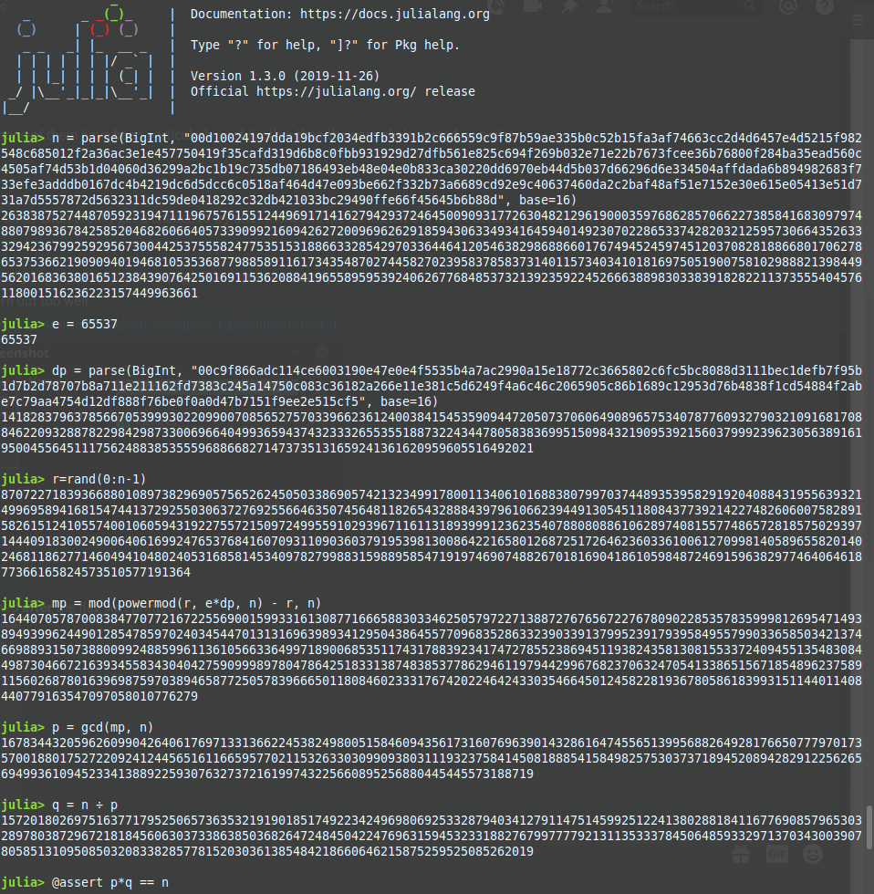
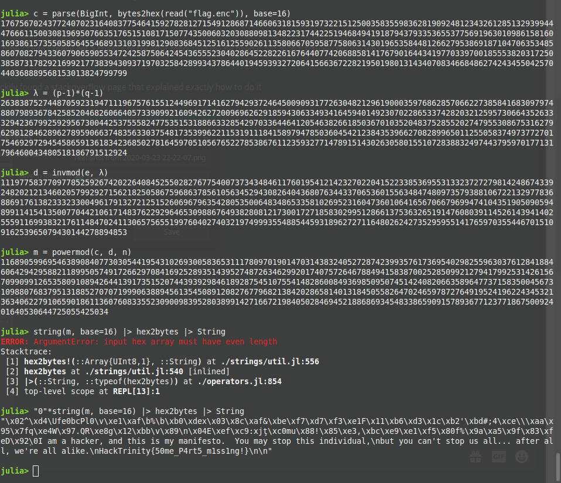

# Numbers - Crypto - 400 points - 5 solves
> _This challenge was created by our sponsor, [ZeroDays](https://zerodays.ie)!_
> 
> Crap! It looks like our private key has been corrupted! It looks like we've
> lost some of the values and the end of the modulus value... Is there any
> way we can possibily recover the encrypted flag now?

### Files:
- [corruptkey.der](corruptkey.der)
- [flag.enc](flag.enc)

The key is in der format, we can use openssl to print the stored values:
```sh
$ openssl rsa -inform der -in corruptkey.der -text
RSA Private-Key: (2048 bit, 2 primes)
modulus:
    00:d1:00:24:19:7d:da:19:bc:f2:03:4e:df:b3:39:
    1b:2c:66:65:59:c9:f8:7b:59:ae:33:5b:0c:52:b1:
    5f:a3:af:74:66:3c:c2:d4:d6:45:7e:4d:52:15:f9:
    82:54:8c:68:50:12:f2:a3:6a:c3:e1:e4:57:75:04:
    19:f3:5c:af:d3:19:d6:b8:c0:fb:b9:31:92:9d:27:
    df:b5:61:e8:25:c6:94:f2:69:b0:32:e7:1e:22:b7:
    67:3f:ce:e3:6b:76:80:0f:28:4b:a3:5e:ad:56:0c:
    45:05:af:74:d5:3b:1d:04:06:0d:36:29:9a:2b:c1:
    b1:9c:73:5d:b0:71:86:49:3e:b4:8e:04:e0:b8:33:
    ca:30:22:0d:d6:97:0e:b4:4d:5b:03:7d:66:29:6d:
    6e:33:45:04:af:fd:ad:a6:b8:94:98:26:83:f7:33:
    ef:e3:ad:dd:b0:16:7d:c4:b4:21:9d:c6:d5:dc:c6:
    c0:51:8a:f4:64:d4:7e:09:3b:e6:62:f3:32:b7:3a:
    66:89:cd:92:e9:c4:06:37:46:0d:a2:c2:ba:f4:8a:
    f5:1e:71:52:e3:0e:61:5e:05:41:3e:51:d7:31:a7:
    d5:55:78:72:d5:63:23:11:dc:59:de:04:18:29:2c:
    32:db:42:10:33:bc:29:49:0f:fe:66:f4:56:45:b6:
    b8:8d
publicExponent: 65537 (0x10001)
privateExponent: 0
prime1: 0
prime2: 0
exponent1:
    00:c9:f8:66:ad:c1:14:ce:60:03:19:0e:47:e0:e4:
    f5:53:5b:4a:7a:c2:99:0a:15:e1:87:72:c3:66:58:
    02:c6:fc:5b:c8:08:8d:31:11:be:c1:de:fb:7f:95:
    b1:d7:b2:d7:87:07:b8:a7:11:e2:11:16:2f:d7:38:
    3c:24:5a:14:75:0c:08:3c:36:18:2a:26:6e:11:e3:
    81:c5:d6:24:9f:4a:6c:46:c2:06:59:05:c8:6b:16:
    89:c1:29:53:d7:6b:48:38:f1:cd:54:88:4f:2a:be:
    7c:79:aa:47:54:d1:2d:f8:88:f7:6b:e0:f0:a0:d4:
    7b:71:51:f9:ee:2e:51:5c:f5
exponent2: 0
coefficient: 0
```
So it looks like all info except the modulus, the publicExponent and exponent1 are. 
If you know basic RSA encryption you should know what the first two of these are. But exponent1 was new to me so I had to do some reading.
In order to speed up encryption, private keys often store 2 extra values: dp = d (mod p-1) and dq = d (mod q-1) where d is the decryption exponent and p & q are the two primes.
Now I could go on to explain the rest of the math but to be honest, I had to google this, luckily I found a [stackexchange question with this exact problem](https://crypto.stackexchange.com/a/46488)!

So it was just a case of doing these calculations, of course we need a language with the capability to do biginteger arithmetic. I chose to do this in Julia, sorry if you were hoping for python.


Now that I have the primes its a basic RSA question:
