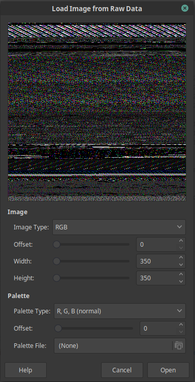
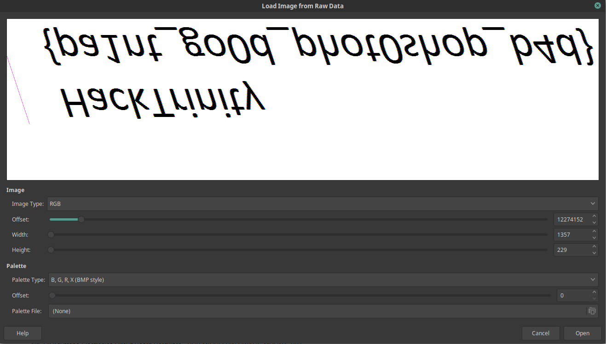

# BSOD - Forensics - 388 points - 15 solves
> With the quarantine going on, I've taken the opportunity to work on
> my art skills. I was working on a flag, but my computer crashed.
> 
> I hadn't saved it, but Windows left this file on my hard drive.
> Maybe there's something recoverable in there?
### Files:
- dump.bin.gz (I didn't include it because it is very large)

So we are given a very big binary file, the gz implies its compressed and when we unzip it using `gzip -d dump.bin.gz` we get a file that is just over 1GB. From the description we can deduce that this dump.bin is a memory dump of the Windows machine.
If we run `binwalk dump.bin` we can see alot of "Microsoft executable, portable (PE)", aka .exe programs. But binwalk just doesn't give us enough information, we need a more specific taylor made for these memory dumps. I used the tool [Volatility](https://www.volatilityfoundation.org/)

Volatility requires you to give the specific profile of the dump, this is information about the OS that this dump was taken from. We know its windows but not what version, luckily there's a tool embedded inside that will try to guess the profile.

```
$ volatility -f dump.bin imageinfo
Volatility Foundation Volatility Framework 2.6
INFO    : volatility.debug    : Determining profile based on KDBG search...
          Suggested Profile(s) : Win7SP1x86_23418, Win7SP0x86, Win7SP1x86
                     AS Layer1 : IA32PagedMemoryPae (Kernel AS)
                     AS Layer2 : FileAddressSpace (/home/david/Documents/ctf/hacktrinity2020/dump.bin)
                      PAE type : PAE
                           DTB : 0x185000L
                          KDBG : 0x82766be8L
          Number of Processors : 1
     Image Type (Service Pack) : 0
                KPCR for CPU 0 : 0x82767c00L
             KUSER_SHARED_DATA : 0xffdf0000L
           Image date and time : 2020-03-17 14:45:57 UTC+0000
     Image local date and time : 2020-03-17 14:45:57 +0000
```

Any of these profiles should work so I chose the first. Now we can list the running processes, what I am looking for is the program used to draw the flag, hopefully the image data is still in the program memory.

```
$ volatility -f dump.bin --profile=Win7SP1x86_23418 pslist
Volatility Foundation Volatility Framework 2.6
Offset(V)  Name                    PID   PPID   Thds     Hnds   Sess  Wow64 Start                          Exit                          
---------- -------------------- ------ ------ ------ -------- ------ ------ ------------------------------ ------------------------------
0x83d33760 System                    4      0     68      341 ------      0 2020-03-17 21:18:52 UTC+0000                                 
0x850fb020 smss.exe                224      4      2       29 ------      0 2020-03-17 21:18:52 UTC+0000                                 
0x85713d40 csrss.exe               304    296      9      349      0      0 2020-03-17 21:18:53 UTC+0000                                 
0x858d7530 csrss.exe               344    336      7      193      1      0 2020-03-17 21:18:55 UTC+0000                                 
...
0x83ea2560 mspaint.exe             744   1148      6      129      1      0 2020-03-17 14:33:39 UTC+0000                                 
0x8491f030 svchost.exe             828    440      6      100      0      0 2020-03-17 14:33:39 UTC+0000                                 
0x8576b608 audiodg.exe            1884    972      7      131      0      0 2020-03-17 14:45:42 UTC+0000                                 
```

There we go, the classic **mspaint.exe**. We can dump the memory using the memdump command: `volatility -f dump.bin --profile=Win7SP1x86_23418 memdump -n mspaint --dump-dir .` which writes the process to 744.dmp. 
Now we can't simply binwalk for the image, because it is loaded into memory, thus there won't be a file header to search for.
Instead we will open it up in GIMP which accepts raw binary .data files. We rename 744.dmp to mspaint.data and open the file in gimp. Then we get a prompt that looks like this:



Now there was no simple way to search for the image, just scrubbing through offset until I found a pattern that might be an image. I needed to use BMP style since thats how mspaint stores the image in memory. Eventually I found the image, which was upside down for bmp reasons:


Since I was already in gimp, it was easy to flip over the image to get the actual image and write down the flag: HackTrinity{pa1nt_go0d_phot0shop_b4d}