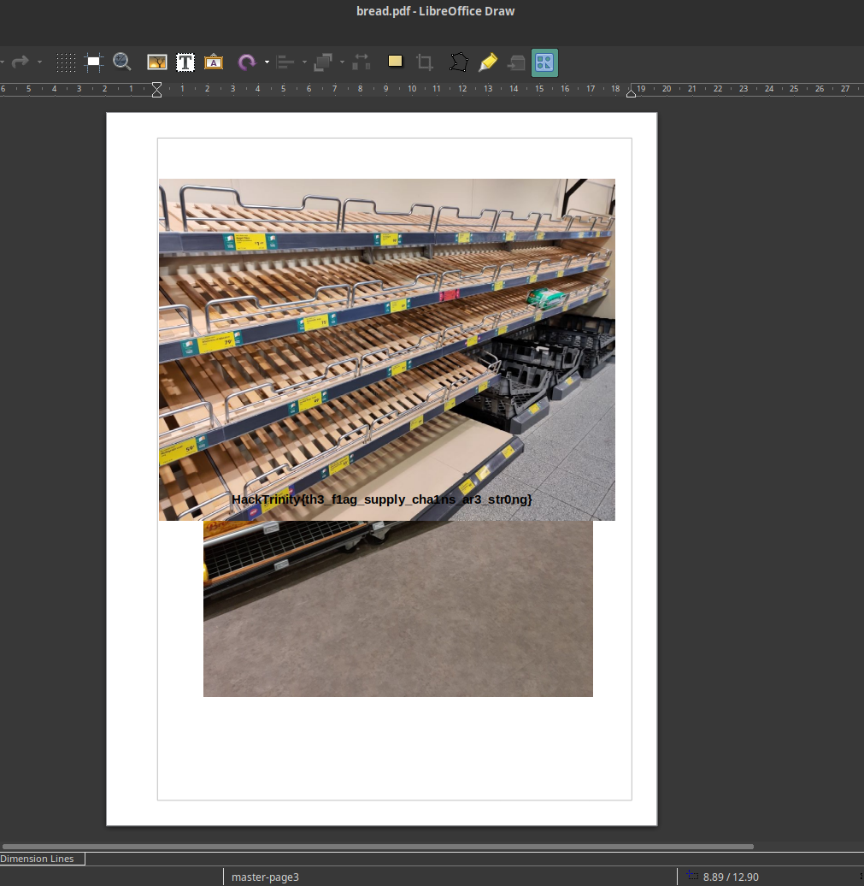

# Panic - Forensics - 136 points - 65 solves
> With all the chaos after Varadkar's announcement, it seems the country has run out of flags!
### Files:
- [bread.pdf](bread.pdf)

This one was very simple, I feel like it was supposed to be harder than it turned out. If you open the file with a pdf viewer you see nothing out of the ordinary but if you open it with a document editor like LibreOffice Draw, you get this:

The flag is plain text aswell so you can copy it straight from the document: HackTrinity{th3_f1ag_supply_cha1ns_ar3_str0ng}